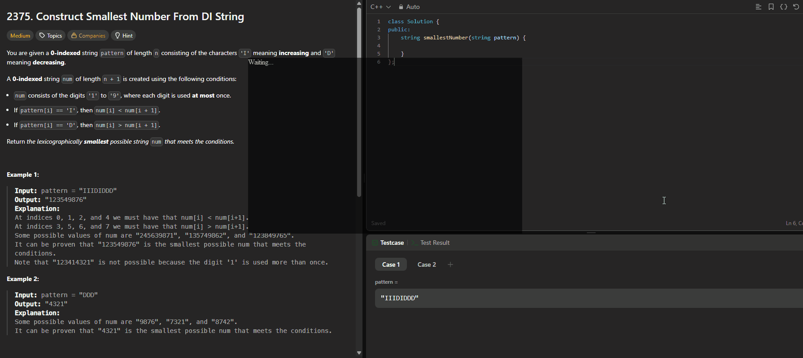

# SnapAI

This project is a locally deployed tool for remote PC screenshot control and AI-powered content analysis using Google Gemini. It features a web service, real-time WebSocket communication, and a desktop AI answer overlay window.



---

## Directory Structure

```
remote-screenshot-system/
├── server/
│   ├── server.py      # Main backend service (Flask + WebSocket + AI analysis)
│   ├── overlay.py     # Desktop AI answer overlay (PyQt5)
│   ├── main.py        # One-click launcher for server.py and overlay.py
│   ├── requirements.txt
│   ├── ...
├── static/           # Static resources
├── templates/        # Web templates
└── README.md         # Documentation
```

---

## Key Features

- 🖥️ **Remote Screenshot**: Take PC screenshots from your mobile browser
- 🤖 **AI Analysis**: Integrate Google Gemini for intelligent screenshot analysis
- 📱 **Mobile Optimized**: Responsive web UI for mobile control
- ⚡ **Real-time Communication**: WebSocket for low-latency bidirectional messaging
- 🪟 **Desktop AI Overlay**: PyQt5-based floating window for AI answers, with global hotkeys and scroll support

---

## Installation & Setup

### 1. Install Dependencies

It is recommended to use Anaconda/Miniconda, or ensure Python 3.8+ is installed.

```sh
cd server
pip install -r requirements.txt
```

### 2. Configure Gemini API Key

- Recommended: Create a `.env` file in the `server/` directory with:
  ```
  GEMINI_API_KEY=your_api_key_here
  ```
- Only `.env` is supported (no config.json)

### 3. Start the System

One-click launch (recommended):
```sh
cd server
python main.py
```

Or start components separately:
```sh
python server.py   # Start backend service (Web + WebSocket)
python overlay.py  # Start desktop AI overlay
```

---

## Component Overview

### server.py
- Flask web server (default port 8080) for mobile interface
- WebSocket server (port 8765) for screenshot and AI query commands
- Google Gemini API for screenshot content analysis
- Reads API key from `.env` only
- Detailed logging

### overlay.py
- PyQt5 desktop floating window for AI answers
- Global hotkeys:
  - F8: Send AI query
  - F9/F10: Scroll content up/down
  - F11: Show window
  - F12: Hide window
- WebSocket client for real-time AI answers
- Supports drag and scroll

### main.py
- One-click launcher for both server.py and overlay.py
- Process management, Ctrl+C to terminate all

---

## Usage

1. After starting, open your mobile browser and visit `http://<PC_IP>:8080/`
2. Use your phone to take screenshots, enter questions, and request AI analysis
3. Use global hotkeys on the desktop to show the overlay and view/scroll AI answers

---

## Troubleshooting

- **WebSocket connection fails?**
  - Check firewall settings for port 8765
  - Ensure PC and phone are on the same LAN
- **No AI response?**
  - Check if the API key is correct and quota is sufficient
  - Check terminal logs for errors
- **Dependency installation fails?**
  - Upgrade pip: `python -m pip install --upgrade pip`
  - Use a mirror: `pip install -i https://pypi.tuna.tsinghua.edu.cn/simple -r requirements.txt`
- **Overlay hotkeys not working?**
  - Ensure the `keyboard` package is installed and run as administrator

---

## References & Credits

- [Google Gemini API](https://ai.google.dev/)
- [PyQt5 Documentation](https://doc.qt.io/qtforpython/)
- [python-dotenv](https://pypi.org/project/python-dotenv/)
- [Project inspiration](https://github.com/faketut/interview.ai)

---

## License

This project is for learning and personal use only. Please comply with relevant laws and API service terms. 
