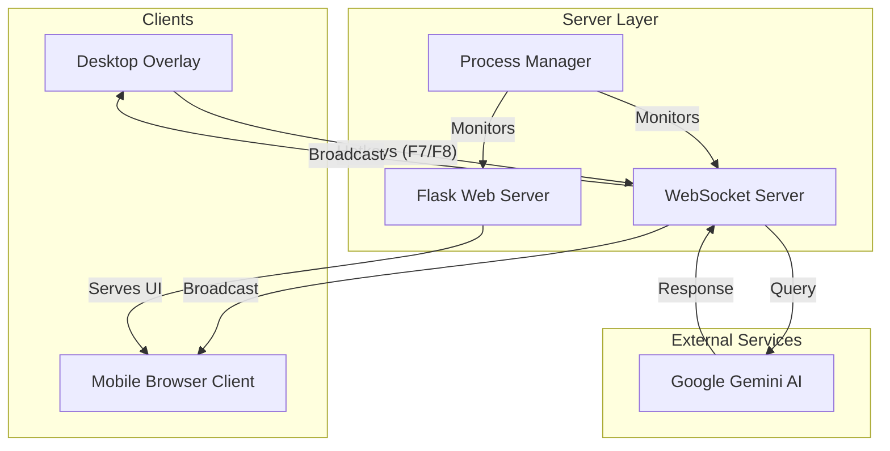

# SnapAI

SnapAI is a modern, locally deployed AI assistant featuring a dual-client architecture for seamless LLM interaction. It provides instant desktop overlay control via global hotkeys and real-time mobile browser synchronization, powered by Google Gemini and a robust WebSocket-based server.

## Architecture


```mermaid
flowchart TD
    subgraph Clients
        DOC[Desktop Overlay]
        MBC[Mobile Browser Client]
    end

    subgraph Server Layer
        WS[WebSocket Server]
        FL[Flask Web Server]
        PM[Process Manager]
    end

    subgraph External Services
        GAI[Google Gemini AI]
    end

    DOC -- "Hotkeys (F7/F8)" --> WS
    WS -- Query --> GAI
    GAI -- Response --> WS
    WS -- Broadcast --> DOC
    WS -- Broadcast --> MBC
    FL -- Serves UI --> MBC
    PM -- Monitors --> WS
    PM -- Monitors --> FL
```

The architecture consists of:

1. **Desktop Client**: A minimalist PyQt5 overlay window that captures inputs and displays AI responses.
2. **Web Server**: A Flask-based server providing the mobile interface.
3. **WebSocket Server**: Handles real-time message broadcasting between all active clients.
4. **Process Manager**: Ensures high availability by monitoring and auto-restarting failed components.
5. **AI Integration**: Direct integration with Google Gemini for text and visual content analysis.

## Prerequisites

- Python 3.8+ installed

## Setup Instructions

### Windows (PowerShell)

1.  **Clone the Repository**:
    ```powershell
    git clone https://github.com/faketut/snapai.git
    cd SnapAI
    ```
2.  **Run Setup Script**:
    ```powershell
    ./setup_venv.bat
    ```
3.  **Activate & Run**:
    ```powershell
    .venv\Scripts\activate
    python main.py
    ```

### Linux / macOS (Bash)

1.  **Clone the Repository**:
    ```bash
    git clone https://github.com/faketut/snapai.git
    cd SnapAI
    ```
2.  **Install System Dependencies (Linux only)**:
    If running on Linux, ensure you have the required X11/XCB libraries:
    ```bash
    sudo apt update && sudo apt install -y libxcb-icccm4 libxcb-image0 libxcb-keysyms1 libxcb-render-util0 libxcb-shape0 libxcb-xinerama0 libxcb-xkb1 libxkbcommon-x11-0
    ```
3.  **Run Setup Script**:
    ```bash
    chmod +x setup_venv.sh
    ./setup_venv.sh
    ```
4.  **Activate & Run**:
    ```bash
    source .venv/bin/activate
    python3 main.py
    ```

### Desktop Overlay Features

-   **System Tray Integration**: SnapAI runs in the background. Right-click the tray icon for quick controls.
-   **Configurable Hotkeys**: Update your shortcuts in `src/config/hotkeys.json` or via the "Configure Hotkeys" dialog in the tray menu.
-   **Local AI Analysis**: Uses Google Gemini to analyze your screen or clipboard and provide coded solutions instantly.
-   **Mobile Remote Trigger**: Use the mobile UI to trigger screenshots on your PC and receive the results instantly on your phone.

### Mobile Synchronization
1. Open your mobile browser and navigate to `http://<YOUR_PC_IP>:8080/`.
2. Use the **TAKE SCREENSHOT** button to remotely trigger a capture on your PC.
3. The AI response will appear automatically on your mobile device.

To create a standalone executable:
1. Follow the instructions in [WINDOWS_PACKAGING.md](file:///root/code/SnapAI/WINDOWS_PACKAGING.md).
2. Run `pyinstaller --clean snapai.spec` on a Windows host.

## Project Structure

```text
├── src/
│   ├── config/                  # Configuration files
│   │   └── hotkeys.json         # Hotkey mappings
│   ├── core/                    # Core business logic
│   │   ├── ai_service.py        # Gemini AI integration
│   │   ├── websocket_handler.py # Message routing
│   │   └── hotkey_manager.py    # Hotkey configuration manager
│   ├── clients/                 # Client implementations
│   │   ├── overlay_window.py    # Desktop overlay (PyQt5)
│   │   └── websocket_client.py  # WebSocket client for overlay
│   ├── server/                  # Server components
│   │   ├── flask_app.py         # Flask web server
│   │   ├── websocket_server.py  # WebSocket server
│   │   ├── main_server.py       # Dual-server orchestrator
│   │   ├── static/              # Web assets
│   │   └── templates/           # Web templates
│   └── process_manager/         # Life-cycle management
├── tests/                       # Test and debug scripts
│   ├── debug_websocket.py
│   └── ...
├── main.py                      # System entrance
├── requirements.txt             # Project dependencies
├── snapai.spec                  # PyInstaller configuration
├── setup_venv.sh                # Linux/macOS setup script
└── setup_venv.bat               # Windows setup script
```

## Core Components Addressed

1. **Dual-Client Architecture**: Seamless sync between desktop and mobile.
2. **Real-time Communication**: Low-latency updates via WebSockets.
3. **Advanced AI Analysis**: Leverages Gemini's multimodal capabilities.
4. **Reliability**: Integrated process manager with heartbeat monitoring.
5. **Modern UI**: Minimalist black-grey-white design across all platforms.

## Future Extensions

- Support for local LLM integration (Ollama/LM Studio).
- Advanced hotkey customization.
- Multiple mobile client support with room-based isolation.
- Enhanced voice-to-text input for mobile clients.

## Troubleshooting

- **Connection Issues**: Ensure port 8080 (Flask) and 8765 (WebSocket) are open on your local firewall.
- **Authentication**: Verify that your API key is correctly set in the `.env` file and that you have remaining quota.
- **Process Failures**: Check the logs generated by `main.py` for specific component errors.
- **Mobile Sync Delay**: Ensure both devices are on the same local area network (LAN).
- **Safari "HTTPS Only" Error**: Safari on iOS may block local HTTP connections.
  1. Ensure you type `http://` explicitly in the address bar.
  2. If it still fails, go to **Settings > Safari > Advanced** and ensure "HTTPS Only Mode" is disabled for local testing.
  3. Alternatively, use a browser like Chrome or Edge which allows clicking "Advanced -> Proceed" for local sites.
- **Linux Setup Error**: If `setup_venv.sh` fails with an "ensurepip" error (common on Debian/Ubuntu), run:
  ```bash
  sudo apt update && sudo apt install python3-venv
  ```

## License

This project is licensed under the MIT License - see the LICENSE file for details.
 