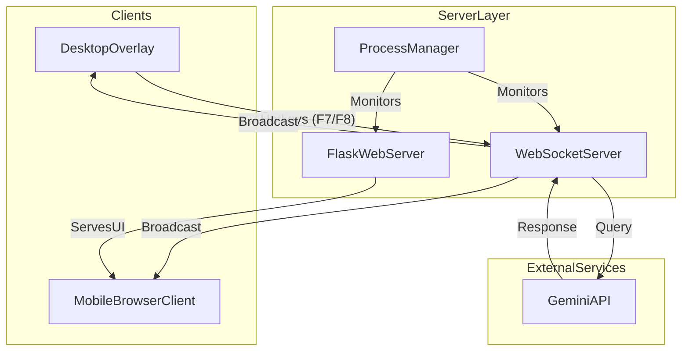

SnapAI
======

SnapAI is a desktop‑first AI assistant that lets you trigger screenshots and clipboard captures from your PC, send them to an LLM, and view the answers both in a minimal overlay window and in a mobile browser UI. It runs entirely on your machine (plus the configured AI API) and is designed to be easy to hack on and extend.

This repository is open source, licensed under the GNU GPLv3 (see `LICENSE`).


Overview
--------

SnapAI consists of three main pieces:

- **Desktop overlay client** (PyQt5)  
  A floating window on your PC that shows AI responses and exposes global hotkeys to capture screenshots or process clipboard content.

- **Server layer** (Flask + WebSocket)  
  - Flask serves the mobile UI on port `8080`.  
  - A WebSocket server on port `8765` broadcasts messages between the desktop overlay and mobile browser clients.

- **Process manager**  
  A supervisor that starts and restarts the server and overlay, and runs health checks on the HTTP endpoint.

High‑level architecture:


```mermaid
flowchart TD
    subgraph Clients
        DOC[DesktopOverlay]
        MBC[MobileBrowserClient]
    end

    subgraph ServerLayer
        WS[WebSocketServer]
        FL[FlaskWebServer]
        PM[ProcessManager]
    end

    subgraph ExternalServices
        GAI[GeminiAPI]
    end

    DOC -- "Hotkeys (F7/F8)" --> WS
    WS -- Query --> GAI
    GAI -- Response --> WS
    WS -- Broadcast --> DOC
    WS -- Broadcast --> MBC
    FL -- ServesUI --> MBC
    PM -- Monitors --> WS
    PM -- Monitors --> FL
```


Features
--------

- **Desktop overlay window**
  - Always‑on‑top, frameless PyQt5 UI.
  - Global hotkeys for:
    - Capture full‑screen screenshot and send to AI.
    - Send clipboard text/image to AI.
    - Show/hide overlay.
  - System tray integration with quick actions.

- **Mobile sync UI**
  - Simple mobile‑optimized page served from your PC.
  - One‑tap “TAKE SCREENSHOT” button that triggers a capture on the desktop.
  - Real‑time display of the latest AI answer.

- **WebSocket‑based messaging**
  - Broadcast AI responses to all connected clients (overlay + mobile).
  - Screenshot requests flow from mobile → server → overlay.

- **Process supervision**
  - Process manager that starts both server and overlay.
  - Health checks against `/health` on port `8080`.
  - Auto‑restart behaviour on crashes (server or overlay).


Project layout
--------------

```text
├── src/
│   ├── config/                  # Configuration files
│   │   └── hotkeys.json         # Hotkey mappings
│   ├── core/                    # Core logic
│   │   ├── ai_service.py        # Gemini integration
│   │   ├── websocket_handler.py # WebSocket message routing
│   │   └── hotkey_manager.py    # Hotkey configuration manager
│   ├── clients/                 # Client implementations
│   │   ├── overlay_window.py    # Desktop overlay (PyQt5)
│   │   └── websocket_client.py  # WebSocket client used by overlay
│   ├── server/                  # Server components
│   │   ├── flask_app.py         # Flask HTTP server
│   │   ├── websocket_server.py  # WebSocket server
│   │   ├── main_server.py       # Combined Flask + WebSocket runner
│   │   ├── static/              # Web assets
│   │   └── templates/           # Jinja templates (mobile UI)
│   └── process_manager/         # Life‑cycle management
├── main.py                      # CLI entry point (process manager / server / client)
├── requirements.txt             # Python dependencies
├── setup_venv.bat               # Windows venv setup helper
├── setup_venv.sh                # Linux/macOS venv setup helper
├── run_snapai.bat               # Start full app (overlay + server) from .venv
├── run_server.bat               # Start server only from .venv
├── LICENSE                      # GPLv3 license
└── tests/                       # Test and debug scripts
```


Requirements
------------

- Windows, macOS, or Linux
- Python 3.8+ installed (system Python or via the Windows `py` launcher)
- An API key for Google Gemini (or compatible generative API) configured in `.env`

> **Note**: On Windows, avoid running SnapAI from a Conda environment. Use the project‑local virtual environment described below so libraries like `websockets` and PyQt5 are isolated from Conda.


Getting started (Windows)
-------------------------

1. **Clone the repository**

   ```powershell
   git clone https://github.com/faketut/snapai.git
   cd snapai
   ```

2. **Create a project‑local virtual environment**

   ```powershell
   .\setup_venv.bat
   ```

   This will:
   - Create `.venv` with `py -3 -m venv` when available, otherwise `python -m venv`.
   - Install all dependencies from `requirements.txt` into `.venv`.

3. **Configure your API key**

   Create a `.env` file in the repository root (you can copy from `.env.sample` if present) and set the required variables, for example:

   ```text
   GEMINI_API_KEY=your_api_key_here
   ```

4. **Run the full app (overlay + server)**

   ```powershell
   .\run_snapai.bat
   ```

   This uses `.venv\Scripts\python.exe` to run `main.py`, which:
   - Starts the WebSocket + Flask server.
   - Starts the overlay client (unless one is already running).

5. **Optional: server‑only mode**

   If you only want to run the HTTP + WebSocket server (for mobile debugging or headless use), you can use:

   ```powershell
   .\run_server.bat
   ```


Getting started (Linux / macOS)
-------------------------------

1. **Clone the repository**

   ```bash
   git clone https://github.com/faketut/snapai.git
   cd snapai
   ```

2. **Install system packages (Linux only)**

   On Debian/Ubuntu and derivatives, you’ll typically need:

   ```bash
   sudo apt update && sudo apt install -y \
     python3-venv \
     libxcb-icccm4 libxcb-image0 libxcb-keysyms1 \
     libxcb-render-util0 libxcb-shape0 libxcb-xinerama0 \
     libxcb-xkb1 libxkbcommon-x11-0
   ```

3. **Create the virtual environment**

   ```bash
   chmod +x setup_venv.sh
   ./setup_venv.sh
   ```

4. **Configure your API key in `.env`**

5. **Activate and run**

   ```bash
   source .venv/bin/activate
   python3 main.py
   ```

   By default, `main.py` runs the process manager, which starts both server and overlay.


Mobile access
-------------

Once the app is running (via `run_snapai.bat` or `python main.py` from the `.venv`):

1. **Ensure PC and phone are on the same LAN**
   - Use the same non‑guest Wi‑Fi SSID.
   - Turn **off** VPN and, on Android, disable Private DNS (or set to automatic).

2. **Find your PC’s IP address**

   On Windows PowerShell:

   ```powershell
   ipconfig
   ```

   Look for the active adapter (e.g. `Wireless LAN adapter WLAN 2`) and note the `IPv4 Address` such as `192.168.2.17`.

3. **Test connectivity from the PC**

   With SnapAI running, from the PC:

   ```powershell
   Invoke-WebRequest -UseBasicParsing http://192.168.2.17:8080/health
   ```

   You should get a 200 response and JSON body.

4. **Test connectivity from the phone**

   In your mobile browser, open (replace with your IP):

   - `http://192.168.2.17:8080/health`
   - `http://192.168.2.17:8080/ping`

   If you see responses there, the network path is working and the server logs will show the client IP.

5. **Use the mobile UI**

   Then open:

   - `http://192.168.2.17:8080/`

   You’ll see the SnapAI mobile page with:

   - A scrollable answer window showing the latest AI response, styled similarly to the desktop overlay.
   - A bottom action bar with two buttons:
     - **screenshot** – requests a new screenshot from your PC.
     - **sync** – fetches and displays the last AI answer again.


Development
-----------

- **Running tests**: check the `tests/` directory for example scripts and pytest tests. A typical pattern:

  ```bash
  source .venv/bin/activate   # or .venv\Scripts\activate on Windows
  pytest
  ```

- **Debugging WebSockets**: there is a `tests/debug_websocket.py` helper to simulate clients and inspect WebSocket behaviour without the UI.

- **Where to look for logic**:
  - AI behaviour: `src/core/ai_service.py`
  - WebSocket message routing: `src/core/websocket_handler.py`
  - Overlay UI: `src/clients/overlay_window.py`
  - Mobile template: `src/server/templates/mobile.html`


Contributing
------------

Contributions are welcome. If you’d like to add features or fix bugs:

1. Fork the repository and create a feature branch.
2. Use the project `.venv` for all development (do not depend on Conda‑specific packages).
3. Add or update tests under `tests/` where appropriate.
4. Make sure the app still starts cleanly and that mobile access works as described above.
5. Open a pull request with a clear description of your changes and their motivation.

For larger changes, consider opening an issue first to discuss design ideas.


License
-------

SnapAI is free software, released under the terms of the **GNU General Public License v3.0 (GPLv3)**. See the [`LICENSE`](LICENSE) file for the full text.
