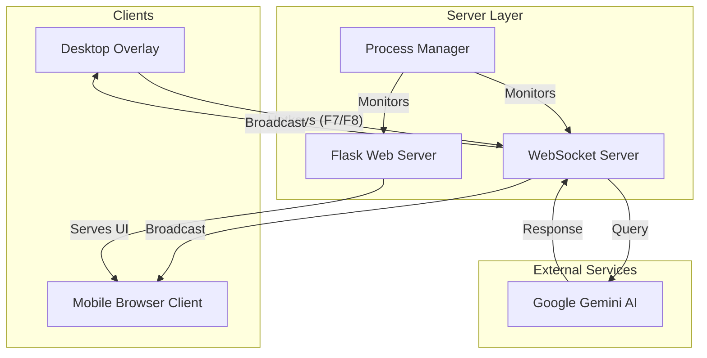

# SnapAI

SnapAI is a modern, locally deployed AI assistant featuring a dual-client architecture for seamless LLM interaction. It provides instant desktop overlay control via global hotkeys and real-time mobile browser synchronization, powered by Google Gemini and a robust WebSocket-based server.

## Architecture


```mermaid
flowchart TD
    subgraph Clients
        DOC[Desktop Overlay]
        MBC[Mobile Browser Client]
    end

    subgraph Server Layer
        WS[WebSocket Server]
        FL[Flask Web Server]
        PM[Process Manager]
    end

    subgraph External Services
        GAI[Google Gemini AI]
    end

    DOC -- "Hotkeys (F7/F8)" --> WS
    WS -- Query --> GAI
    GAI -- Response --> WS
    WS -- Broadcast --> DOC
    WS -- Broadcast --> MBC
    FL -- Serves UI --> MBC
    PM -- Monitors --> WS
    PM -- Monitors --> FL
```

The architecture consists of:

1. **Desktop Client**: A minimalist PyQt5 overlay window that captures inputs and displays AI responses.
2. **Web Server**: A Flask-based server providing the mobile interface.
3. **WebSocket Server**: Handles real-time message broadcasting between all active clients.
4. **Process Manager**: Ensures high availability by monitoring and auto-restarting failed components.
5. **AI Integration**: Direct integration with Google Gemini for text and visual content analysis.

## Prerequisites

- Python 3.8+ installed
- Google Gemini API Key
- Git installed

## Setup Instructions

### 1. Clone the Repository

```bash
git clone https://github.com/your-repo/SnapAI.git
cd SnapAI
```

### 2. Set up Environment

1. Create and activate a virtual environment using the provided scripts:

**Linux/macOS:**
```bash
chmod +x setup_venv.sh
./setup_venv.sh
source .venv/bin/activate
```

**Windows:**
```bash
./setup_venv.bat
.venv\Scripts\activate
```

2. All necessary dependencies from `requirements.txt` will be installed automatically by the setup scripts.

### 3. Configure Environment Variables

Create a `.env` file in the project root directory and add your Gemini API key:

```env
GEMINI_API_KEY=your_gemini_api_key_here
```

### 4. Launch the Application

Start the integrated system using the main launcher:

```bash
python main.py
```

For Windows users, you can also use the provided batch script:

```bash
./snap.ai.bat
```

## System Usage

### Desktop Overlay Controls

The system listens for global hotkeys to trigger AI interactions:

- **F7**: Captures current screen area and sends it to Gemini for analysis.
- **F8**: Reads text or image from clipboard and provides a coded solution.
- **F9**: Toggles display of the overlay window.
- **F10**: Hides the overlay window completely.

### Desktop App Features

-   **System Tray Integration**: SnapAI now runs in the system tray. Double-click the tray icon to show/hide the overlay.
-   **Real-time Configuration**: Right-click the tray icon and select **Configure Hotkeys** to remap shortcuts instantly without restarting the application.
-   **Standard Launcher**: Use the provided `snapai.desktop` (Linux) or `snapai.bat` (Windows) to launch the app like any other desktop application.

### Mobile Synchronization

1. Open your mobile browser and navigate to `http://<YOUR_PC_IP>:8080/`.
2. All AI responses generated on the desktop will appear automatically on your mobile device.
3. Use the **REFRESH SYNC** button to fetch the latest response if the connection was interrupted.

## Project Structure

```text
├── src/
│   ├── config/                  # Configuration files
│   │   └── hotkeys.json         # Hotkey mappings
│   ├── core/                    # Core business logic
│   │   ├── ai_service.py        # Gemini AI integration
│   │   ├── websocket_handler.py # Message routing
│   │   └── hotkey_manager.py    # Hotkey configuration manager
│   ├── clients/                 # Client implementations
│   │   ├── overlay_window.py    # Desktop overlay (PyQt5)
│   │   └── websocket_client.py  # WebSocket client for overlay
│   ├── server/                  # Server components
│   │   ├── flask_app.py         # Flask web server
│   │   ├── websocket_server.py  # WebSocket server
│   │   ├── main_server.py       # Dual-server orchestrator
│   │   ├── static/              # Web assets
│   │   └── templates/           # Web templates
│   └── process_manager/         # Life-cycle management
├── tests/                       # Test and debug scripts
│   ├── debug_websocket.py
│   └── ...
├── main.py                      # System entrance
├── requirements.txt             # Project dependencies
├── snapai.spec                  # PyInstaller configuration
├── setup_venv.sh                # Linux/macOS setup script
└── setup_venv.bat               # Windows setup script
```

## Core Components Addressed

1. **Dual-Client Architecture**: Seamless sync between desktop and mobile.
2. **Real-time Communication**: Low-latency updates via WebSockets.
3. **Advanced AI Analysis**: Leverages Gemini's multimodal capabilities.
4. **Reliability**: Integrated process manager with heartbeat monitoring.
5. **Modern UI**: Minimalist black-grey-white design across all platforms.

## Future Extensions

- Support for local LLM integration (Ollama/LM Studio).
- Advanced hotkey customization.
- Multiple mobile client support with room-based isolation.
- Enhanced voice-to-text input for mobile clients.

## Troubleshooting

- **Connection Issues**: Ensure port 8080 (Flask) and 8765 (WebSocket) are open on your local firewall.
- **Authentication**: Verify that your API key is correctly set in the `.env` file and that you have remaining quota.
- **Process Failures**: Check the logs generated by `main.py` for specific component errors.
- **Mobile Sync Delay**: Ensure both devices are on the same local area network (LAN).
- **Linux Setup Error**: If `setup_venv.sh` fails with an "ensurepip" error (common on Debian/Ubuntu), run:
  ```bash
  sudo apt update && sudo apt install python3-venv
  ```

## License

This project is licensed under the MIT License - see the LICENSE file for details.
 