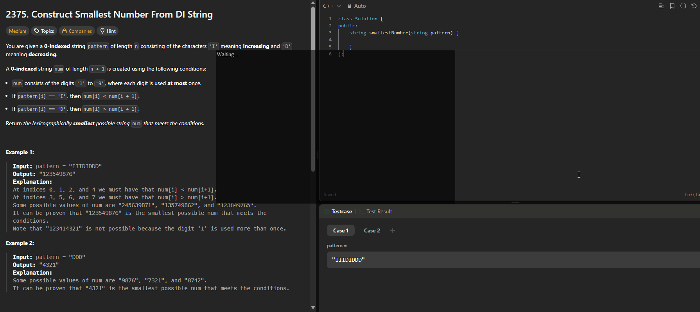

# SnapAI

A locally deployed AI assistant with dual-client architecture for seamless LLM interaction. Features desktop overlay control via hotkeys and mobile browser synchronization, powered by Google Gemini with robust WebSocket communication.



## Quick Start

### 1. Setup Environment
```sh
# Create conda environment
conda create -n snap.ai python=3.8+
conda activate snap.ai

# Install dependencies
pip install -r requirements.txt
```

### 2. Configure API Key
Create `.env` file:
```
GEMINI_API_KEY=your_gemini_api_key_here
```

### 3. Launch System

**Production Mode:**
```sh
# One-click launch
python main.py

# Or use Windows batch script
snap.ai.bat
```

**Development Mode (with Hot Reload):**
```sh
# Development server with hot reload
python dev_server.py --debug

# Or use Windows batch script
dev.bat
```

## Features

- 🎯 **Hotkey-Controlled AI**: Instant queries via F7/F8 hotkeys
- 🔄 **Dual-Client Sync**: AI responses display simultaneously in overlay and mobile browser
- ⚡ **Robust Communication**: WebSocket with auto-reconnection
- 🤖 **Google Gemini Integration**: Advanced AI analysis for screenshots and text
- 📱 **Mobile Browser Client**: Real-time display and sync
- 🪟 **Desktop Overlay**: Floating PyQt5 window with drag, scroll, and hotkey support
- 🔒 **Single Instance**: Prevents multiple overlay windows
- 🔥 **Hot Reload**: Development mode with automatic file watching and reloading

## Usage

### Desktop Overlay Controls
- **F7**: Capture screenshot → AI analyzes and answers
- **F8**: Send clipboard content → AI solves with code
- **F9**: Show overlay window
- **F10**: Hide overlay window

### Mobile Browser Sync
- Open `http://<PC_IP>:8080/` on your mobile browser
- View real-time AI responses synchronized from desktop overlay
- Responses appear automatically in both overlay and mobile browser

## Architecture

### Directory Structure
```
SnapAI/
├── src/
│   ├── core/                    # Core business logic
│   │   ├── ai_service.py       # Google Gemini AI integration
│   │   └── websocket_handler.py # WebSocket message handling
│   ├── clients/                 # Client implementations
│   │   ├── overlay_window.py   # Desktop overlay (PyQt5)
│   │   └── websocket_client.py # WebSocket client for overlay
│   ├── server/                  # Server components
│   │   ├── flask_app.py        # Flask web server
│   │   ├── websocket_server.py # WebSocket server
│   │   └── main_server.py      # Combined server orchestrator
│   └── process_manager/         # Process management
│       └── process_manager.py  # Process monitoring & restart
├── templates/
│   └── mobile.html             # Mobile browser client
├── static/                     # Static web assets
├── server.py                   # Server entry point
├── overlay.py                  # Overlay entry point
├── main.py                     # Main launcher
└── snap.ai.bat                 # Windows batch launcher
```

### Connection Flow
```
Desktop Overlay (F7/F8) → WebSocket → Central Server → Gemini AI
                                    ↓
                              Broadcast Response
                                    ↓
                    Desktop Overlay ← → Mobile Browser
```

## Troubleshooting

### Connection Issues
- **WebSocket connection fails?**
  - Check firewall settings for ports 8080 and 8765
  - Ensure PC and mobile device are on the same LAN
  - Verify server is running: `python server.py`

- **Mobile browser not syncing?**
  - Check WebSocket connection status in browser console
  - Try refreshing the mobile page
  - Verify server logs for client connections

### AI Response Issues
- **No AI response?**
  - Verify Gemini API key in `.env` file
  - Check API quota and billing status
  - Review server logs for AI service errors

- **Slow AI responses?**
  - Check internet connection
  - Verify Gemini API status

### System Issues
- **Hotkeys not working?**
  - Run as administrator (Windows)
  - Ensure `keyboard` package is installed
  - Check if overlay window has focus

- **Multiple overlay windows?**
  - The system now prevents multiple overlay instances
  - If you see multiple windows, restart the application
  - Check for stale lock files in the project directory

## Development

### Hot Reload Development Server
The project includes a development server with hot reload capabilities for faster development:

```sh
# Start development server
python dev_server.py --debug

# Or use Windows batch
dev.bat
```

**Features:**
- 🔥 **Automatic Reload**: Changes to Python files trigger server restart
- 📱 **Template Reload**: HTML template changes are reflected immediately
- 🎨 **CSS Reload**: Static file changes are detected and served
- 📊 **File Watching**: Monitors `templates/`, `static/`, and `src/` directories
- 🐛 **Debug Mode**: Enhanced logging and error reporting

**Watched File Types:**
- `.py` files → Server restart
- `.html` files → Template reload
- `.css` files → Static file reload
- `.js` files → Static file reload

## Technical Details

### Key Components
- **Central Server**: Flask + WebSocket server managing all clients
- **Desktop Client**: PyQt5 overlay with singleton pattern
- **Mobile Client**: HTML/JavaScript with WebSocket connection
- **Process Management**: Auto-restart failed components
- **Instance Control**: Prevents multiple overlay windows
- **Hot Reload**: File watching and automatic reloading for development

### Performance Features
- **Concurrent Broadcasting**: AI responses sent to all clients simultaneously
- **Connection Pooling**: Efficient client management with auto-cleanup
- **Memory Optimization**: Proper resource cleanup and garbage collection
- **Error Recovery**: Automatic reconnection and process restart capabilities

## License

This project is for learning and personal use only. Please comply with relevant laws and API service terms. 